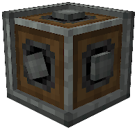

# Create: Advanced Gearbox

This mod is designed to be as simple and lightweight as possible, adding just a single, seemingly simple block: a gearbox with dynamic inputs.

## Download

At: https://legacy.curseforge.com/minecraft/mc-mods/create-advanced-gearbox

## Content

The Gearbox is designed to be a more compact form of a 6 way output, which would have 4 large gears and a vertical gearbox inside.

